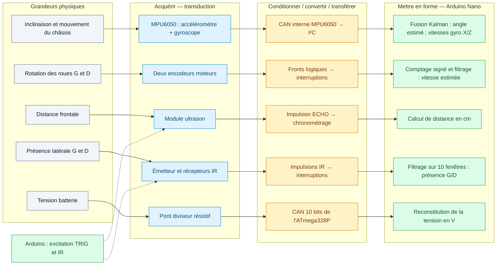
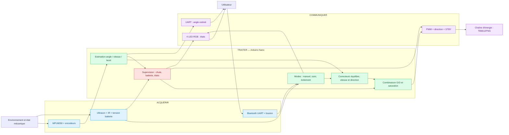
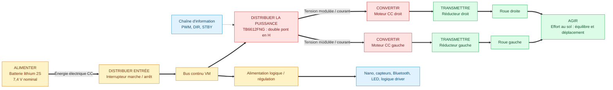

```mermaid
flowchart LR
    subgraph PH["Grandeurs physiques"]
        P1["Inclinaison et mouvement du châssis"]
        P2["Rotation des roues G et D"]
        P3["Distance frontale"]
        P4["Présence latérale G et D"]
        P5["Tension batterie"]
    end
    subgraph CAP["Acquérir — transduction"]
        S1["MPU6050 : accéléromètre + gyroscope"]
        S2["Deux encodeurs moteurs"]
        S3["Module ultrason"]
        S4["Émetteur et récepteurs IR"]
        S5["Pont diviseur résistif"]
    end
    subgraph INT["Conditionner / convertir / transférer"]
        C1["CAN interne MPU6050 → I²C"]
        C2["Fronts logiques → interruptions"]
        C3["Impulsion ECHO → chronométrage"]
        C4["Impulsions IR → interruptions"]
        C5["CAN 10 bits de l'ATmega328P"]
    end
    subgraph DATA["Mettre en forme — Arduino Nano"]
        D1["Fusion Kalman : angle estimé ; vitesses gyro X/Z"]
        D2["Comptage signé et filtrage : vitesse estimée"]
        D3["Calcul de distance en cm"]
        D4["Filtrage sur 10 fenêtres : présence G/D"]
        D5["Reconstitution de la tension en V"]
    end
    P1 --> S1 --> C1 --> D1
    P2 --> S2 --> C2 --> D2
    P3 --> S3 --> C3 --> D3
    P4 --> S4 --> C4 --> D4
    P5 --> S5 --> C5 --> D5
    MCU["Arduino : excitation TRIG et IR"] -.-> S3
    MCU -.-> S4
    classDef physical fill:#f1f5f9,stroke:#64748b,color:#0f172a
    classDef sensor fill:#e0f2fe,stroke:#0284c7,color:#0c4a6e
    classDef interface fill:#fef3c7,stroke:#d97706,color:#78350f
    classDef digital fill:#dcfce7,stroke:#16a34a,color:#14532d
    class P1,P2,P3,P4,P5 physical
    class S1,S2,S3,S4,S5 sensor
    class C1,C2,C3,C4,C5 interface
    class D1,D2,D3,D4,D5,MCU digital
```

```mermaid
flowchart LR
    ENV["Environnement et état mécanique"]
    USER["Utilisateur"]
    subgraph A["ACQUÉRIR"]
        S["MPU6050 + encodeurs"]
        E["Ultrason + IR + tension batterie"]
        U["Bluetooth UART + bouton"]
    end
    subgraph T["TRAITER — Arduino Nano"]
        F["Estimation angle / vitesse / lacet"]
        M["Modes : manuel, suivi, évitement"]
        R["Correcteurs équilibre, vitesse et direction"]
        SAFE["Supervision : chute, batterie, états"]
        MIX["Combinaison G/D et saturation"]
    end
    subgraph C["COMMUNIQUER"]
        PWM["PWM + direction + STBY"]
        LED["4 LED RGB : états"]
        TEL["UART : angle estimé"]
    end
    POWER["Chaîne d'énergie : TB6612FNG"]
    ENV --> S --> F --> R --> MIX --> PWM --> POWER
    ENV --> E --> M --> R
    USER --> U --> M
    E --> SAFE
    F --> SAFE --> MIX
    SAFE --> PWM
    SAFE --> LED --> USER
    M --> LED
    F --> TEL --> USER
    classDef info fill:#e0f2fe,stroke:#0284c7,color:#0c4a6e
    classDef control fill:#dcfce7,stroke:#16a34a,color:#14532d
    classDef safety fill:#fee2e2,stroke:#dc2626,color:#7f1d1d
    classDef output fill:#f3e8ff,stroke:#9333ea,color:#581c87
    class S,E,U info
    class F,M,R,MIX control
    class SAFE safety
    class PWM,LED,TEL,POWER output
```

```mermaid
flowchart LR
    B["ALIMENTER<br/>Batterie lithium 2S<br/>7,4 V nominal"]
    SW["DISTRIBUER ENTRÉE<br/>Interrupteur marche / arrêt"]
    BUS["Bus continu VM"]
    H["DISTRIBUER LA PUISSANCE<br/>TB6612FNG : double pont en H"]
    L["CONVERTIR<br/>Moteur CC gauche"]
    R["CONVERTIR<br/>Moteur CC droit"]
    GL["TRANSMETTRE<br/>Réducteur gauche"]
    GR["TRANSMETTRE<br/>Réducteur droit"]
    WL["Roue gauche"]
    WR["Roue droite"]
    ACT["AGIR<br/>Effort au sol : équilibre et déplacement"]
    REG["Alimentation logique / régulation"]
    ELEC["Nano, capteurs, Bluetooth, LED, logique driver"]
    CMD["Chaîne d'information<br/>PWM, DIR, STBY"]
    B ==>|"Énergie électrique CC"| SW ==> BUS ==> H
    H ==>|"Tension modulée / courant"| L ==> GL ==> WL ==> ACT
    H ==>|"Tension modulée / courant"| R ==> GR ==> WR ==> ACT
    BUS ==> REG ==> ELEC
    CMD -.-> H
    classDef source fill:#fef3c7,stroke:#d97706,color:#78350f
    classDef power fill:#fee2e2,stroke:#dc2626,color:#7f1d1d
    classDef mechanical fill:#dcfce7,stroke:#16a34a,color:#14532d
    classDef info fill:#e0f2fe,stroke:#0284c7,color:#0c4a6e
    class B,SW,BUS,REG source
    class H,L,R power
    class GL,GR,WL,WR,ACT mechanical
    class CMD,ELEC info
```